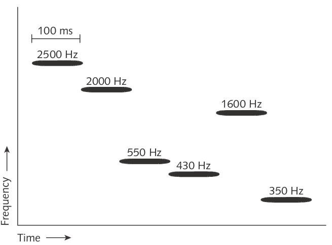
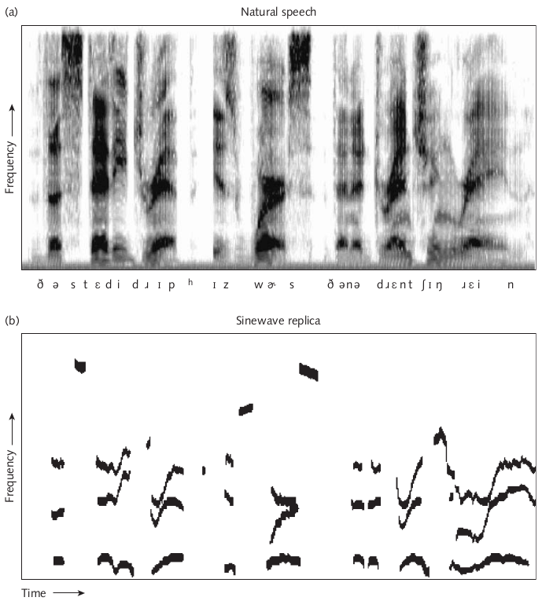
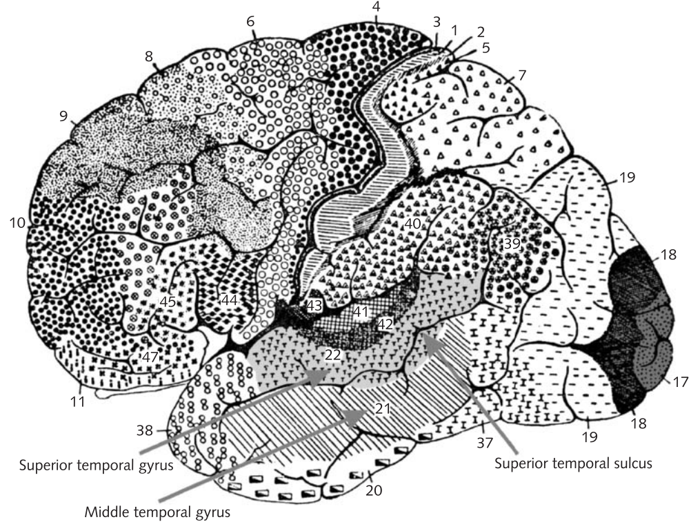
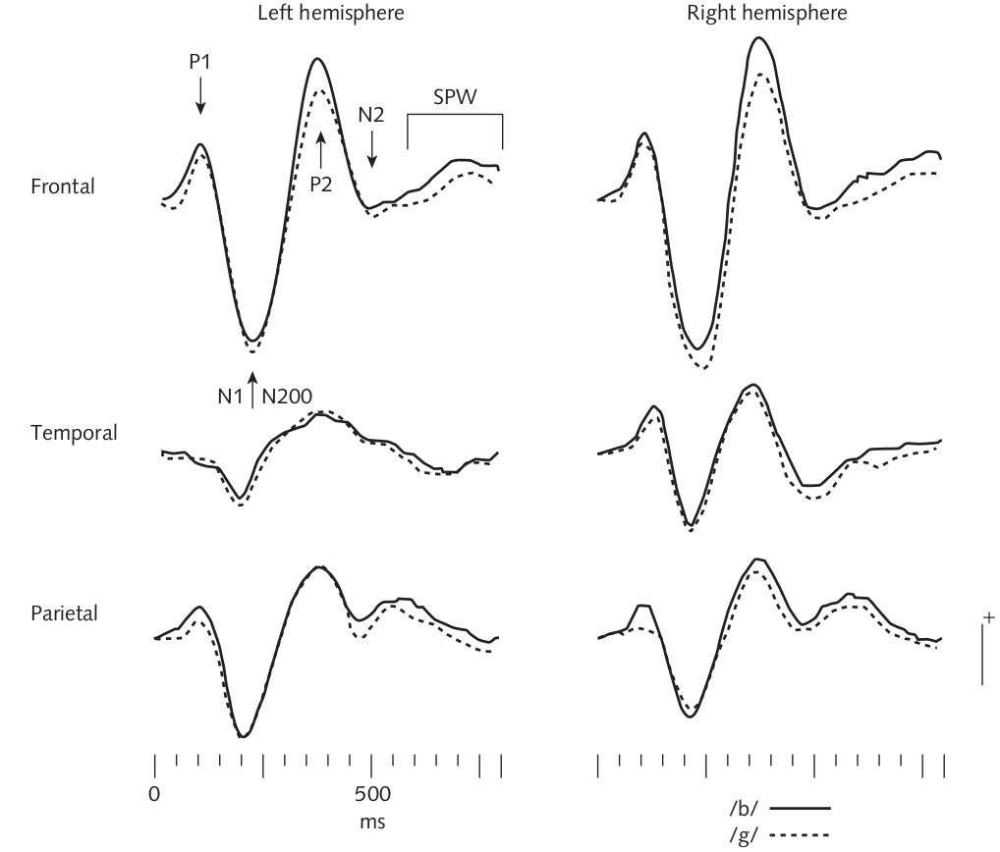

# Robert E. Remez, Perceptual Organization of Speech

Современные исследования восприятия речи основываются на предыдущих более общих исследованиях восприятия (психологов).

**Гештальт нечто** --- мы сначала собираем объекты восприятия (аудио, визуальные и т. п.), а потом классифицируем. 

Мультимодальное восприятие... см. следующий раздел

# Lawrence D. Rosenblum, Primacy of Multimodal Speech Perception
Модальность...

* чтение по губам
* эффект МакГурка
* другие исследования мультимодального восприятия (не связанные с речью)

# Lynne E. Bernstein, Phonetic Processing by the Speech Perceiving Brain
Первая ступень обработки – общий механизм обработки информации, потом – специализация. 

Зоны Бродмана: для зрения BA17, для слуха BA41 – «начальные» уровни восприятия.

Акустическое и звуковое восприятие речи – те же зоны, что и восприятие НЕ-речи.

Не только зоны, отвечающие за восприятие звуков или за восприятие визуальной информации.

Начальное восприятие звуков: высота тона, временные качества??, интенсивность
Начальное зрительное восприятие: цвет, форма, движение, размер, глубина; позже – различение лица от не-лица. У людей, которые профессионально читают по губам, зоны зрительного восприятия задействованы больше. Разное восприятие фонетической и нефонетической. 

Задействованы специальные зоны для обработки речи 
Обезьяны vs. Люди (нет непосредственной связи между аудио и видео восприятием)
Данные ФМРТ: неструктурированный шум, псевдослова, перевернутая речь… («fMRI not good enough»)

Слух и зрение: стоит ли воспринимать отдельно?
Эффект МакГурка: проявляется при несочетаемости говорящих на видео и аудио, при знании и незнании о существовании иллюзии, от качества записи, при асинхронии стимулов; не проявляется или проявляется частично: у людей разных культур, при тренировке, (не)знакомый спикер.
Восприятие речи = сумма активаций отдельных зон, отвечающих за конкретную фунцию (только слух или зрение)

# Dennis L. Molfese, et al. Event-Related Evoked Potentials (ERPs) in Speech Perception
Что-то вроде предыдущей статьи, но ЭЭГ.

Они смотрят на некоторую категаризацию из естественного языка (VOT, место образования, гласные) у разных возрастных групп, а дальше смотрят на кластеризацию графиков ЭЭГ (сильно упрощаю).