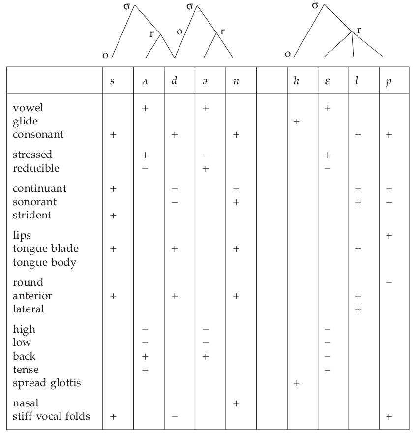

# Kenneth N. Stevens, Features in Speech Perception and Lexical Access

[Надин конспект](https://github.com/agricolamz/phonreadinggroup/raw/master/2018.11.28/Chapter6_handout.pdf)

Бинарные признаки как в Jakobson, Trubetzkoy > Jakobson, Halle, Fant > Halle, Chomsky.

> Indirect evidence for the role of distinctive features in speech perception comes
from experiments that examine consonant confusions made by listeners when
they identify the consonants in consonant-vowel syllables in noise and with band-
pass filtering (Miller & Nicely, 1955). The results of these experiments show that
the patterns of confusions are organized along featural lines. In the presence of
noise and certain types of band-pass filtering, some features are poorly identified
while others are robust. Miller and Nicely suggest that the perception of any one
feature is somewhat independent of the perception of the other features, as though
separate channels are involved in the perception of the different features.

Признаки бывают **articulator-free** и **articulator-bound** (Halle, 1992).

Как все хранится в голове? Типа так:

# Edward Flemming, Speech Perception and Phonological Contrast

# Lawrence J. Raphael, Acoustic Cues to the Perception of Segmental Phonemes

[Конспект Виолы](https://github.com/agricolamz/phonreadinggroup/raw/master/2018.11.28/handout-8.pdf)